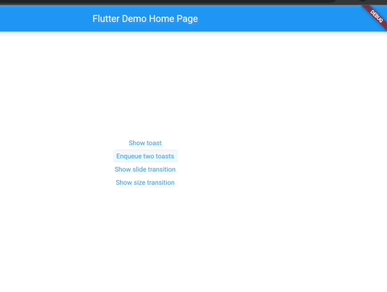
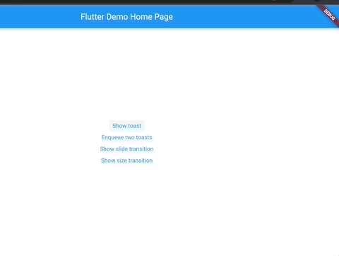
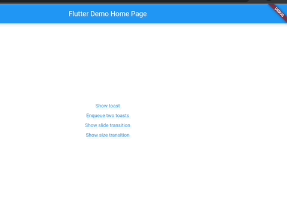

# 🥪 Toasted 

Displays toasts in a queue similar to the default SnackBar but with more extensive customization including:

* Intrinsically sized toasts ([SnackBar](https://api.flutter.dev/flutter/material/SnackBar-class.html]) needs a fixed-width for some reason).
* Custom toast animations
* Custom toast positioning.

.

## Usage

To enable toast support, wrap your app in a `ToastedProvider` widget:

```dart
class MyApp extends StatelessWidget {
  const MyApp({Key? key}) : super(key: key);

  @override
  Widget build(BuildContext context) {
    return ToastedProvider(
      child: MaterialApp(
        title: 'MyApp',
        home: Container(),
      ),
    );
  }
}
```

You can then show toasts from anywhere in the build tree using the [ToastedMessenger](https://github.com/danReynolds/toasted/blob/master/lib/toasted_messenger.dart):

```dart
ToastedMessenger.of(context)!.show(
  Toasted(
    context: context,
    duration: const Duration(seconds: 3),
    child: Material(
      color: Colors.transparent,
      child: Container(
        padding: const EdgeInsets.symmetric(horizontal: 12, vertical: 10),
        margin: const EdgeInsets.all(12),
        decoration: BoxDecoration(
          color: black,
          borderRadius: BorderRadius.circular(4),
        ),
        child: Text(
          text,
          style: TextStyle(color: white),
        ),
      ),
    ),
  ),
);
```

Check out this working example and others in the [demo app](https://github.com/danReynolds/toasted/blob/master/example/lib/main.dart).

## Custom animations

Custom toast animations are supported through the `transitionBuilder` API:

```dart
ToastedMessenger.of(context)!.show(
  Toasted(
    context: context,
    duration: const Duration(seconds: 3),
    transitionBuilder: (context, animation, child) {
      return Positioned(
        bottom: 0,
        right: 0,
        child: SlideTransition(
          position: Tween<Offset>(
            begin: const Offset(0, 1),
            end: Offset.zero,
          ).animate(animation),
          child: child,
        ),
      );
    },
    child: const Align(
      alignment: Alignment.bottomRight,
      child: ToastContainer(
        text: 'This is a slide transition toast',
      ),
    ),
  ),
);
```

Any transition can be provided and it works out of the box with built-in transitions like:

* [FadeTransition](https://api.flutter.dev/flutter/widgets/FadeTransition-class.html)
.

* [SlideTransition](https://api.flutter.dev/flutter/widgets/SlideTransition-class.html)

.

* [SizeTransition](https://api.flutter.dev/flutter/widgets/SizeTransition-class.html)

.
